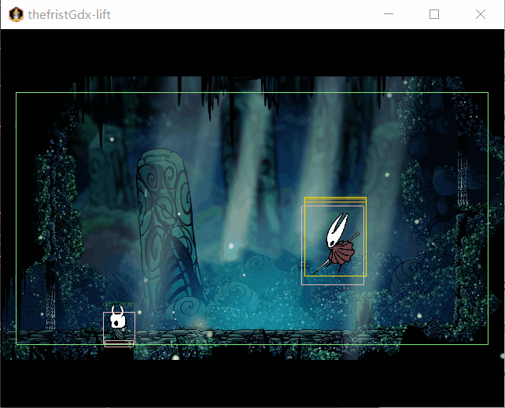

# A Tiny Hollow Knight-Inspired Demo

A tiny imitation of *Hollow Knight*.

Built with **libGDX**, this is a small-scale project inspired by the boss fight against Hornet.

---

## 3 Advanced Concepts

1. **Game Engine (GUI)**:
   I use **libGDX** as the base platform to develop the game. It helps manage game assets (animations), detect collisions, debug, and more.
2. **State Machine**:
   For the boss logic, I use a state machine, which makes the structure and movement logic easy to control and extend.
3. **Database**:
   I use **SQLite** to store the game's completion time and display it at the end of the game.

---

## Introduction to the Game

### Player Controls

- **WASD** to move
- **J** to attack
- Press **J** twice quickly for a double attack
- **J + S** to down attack (while in the air)
- **K** to jump, press **K** again in the air to double jump
- **L** to dash (invincible during the dash)

### Boss Behaviors

The boss can:

- Move
- Dash
- Jump
- Jump and dash

All actions are triggered randomly or based on the player's behavior.

---

## Game Features

- Press **P** to pause and resume the game.

---

## How to Run

1. Download the project files.
2. Use **Gradle** to build and run the project!

---

Enjoy the fight!

